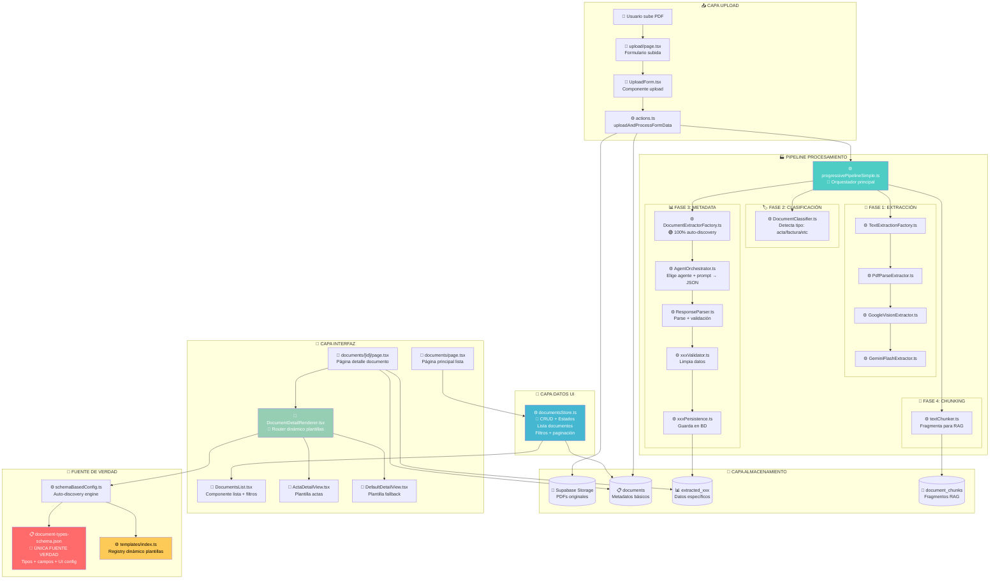
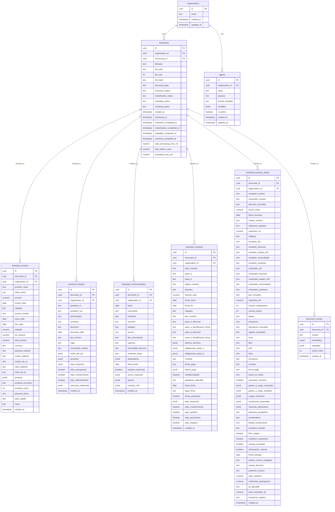

# 📄 MÓDULO DE DOCUMENTOS - CASO DE ÉXITO DOCUMENTADO

Completamente implementado y funcionando en `http://localhost:3001/documents`

## 1. PROPÓSITO DEL MÓDULO

### Objetivo Principal

Crear un **sistema completo de gestión inteligente de documentos PDF** para comunidades de propietarios que:

1. **Permita subida masiva** de documentos (actas, facturas, contratos, comunicados)
2. **Procese automáticamente** el contenido con IA para extraer información estructurada
3. **Organice y visualice** la información de manera intuitiva y profesional
4. **Mantenga aislamiento multi-tenant** por organización y comunidad
5. **Proporcione búsqueda avanzada** por metadatos extraídos automáticamente

## PROCESO



## ORGANIZACION ARHIVOS

```
src/
├── app/
│   └── (dynamic-pages)/(main-pages)/(logged-in-pages)/documents/
│       ├── actions.ts                        # 🔧 PROCESO - Server Actions para upload
│       ├── page.tsx                          # 🎨 UI - Lista de documentos
│       ├── upload/
│       │   └── page.tsx                      # 🎨 UI - Página de subida de documentos
│       ├── templates/
│       │   └── page.tsx                      # 🎨 UI - Página de plantillas
│       └── [id]/
│           └── page.tsx                      # 🎨 UI - Página detalle de documento
├── components/
│   └── documents/
│       ├── templates/
│       │   ├── FacturaDetailView.tsx         # 🎨 UI - Vista detalle para facturas
│       │   ├── AlbaranDetailView.tsx         # 🎨 UI - Vista detalle para albaranes
│       │   ├── PresupuestoDetailView.tsx     # 🎨 UI - Vista detalle para presupuestos
│       │   ├── ActaDetailView.tsx            # 🎨 UI - Vista detalle para actas
│       │   ├── ContratoDetailView.tsx        # 🎨 UI - Vista detalle para contratos
│       │   ├── ComunicadoDetailView.tsx      # 🎨 UI - Vista detalle para comunicados
│       │   ├── EscrituraCompraventaDetailView.tsx # 🎨 UI - Vista detalle para escrituras
│       │   ├── DefaultDetailView.tsx         # 🎨 UI - Vista genérica para documentos
│       │   └── index.ts                      # 🎨 UI - Exporta vistas detalle
│       ├── DocumentDetailRenderer.tsx        # 🎨 UI - Renderiza vista según tipo
│       ├── DocumentsList.tsx                 # 🎨 UI - Lista de documentos
│       └── UploadForm.tsx                    # 🎨 UI - Formulario de subida
├── lib/
│   ├── ingesta/
│   │   ├── doc_documentos.md                 # 📚 DOC - Documentación del sistema
│   │   ├── core/
│   │   │   ├── progressivePipelineSimple.ts  # 🔧 PROCESO - Pipeline principal (1272 líneas)
│   │   │   ├── strategies/                   # 📁 MÓDULO ESTRATEGIAS DOCUMENTO
│   │   │   │   ├── BaseDocumentExtractor.ts  # 🔧 PROCESO - Interfaz base (65 líneas)
│   │   │   │   ├── ActaExtractor.ts          # 🔧 PROCESO - Estrategia actas (70 líneas)
│   │   │   │   ├── ComunicadoExtractor.ts    # 🔧 PROCESO - Estrategia comunicados (70 líneas)
│   │   │   │   ├── FacturaExtractor.ts       # 🔧 PROCESO - Estrategia facturas (70 líneas)
│   │   │   │   ├── ContratoExtractor.ts      # 🔧 PROCESO - Estrategia contratos (70 líneas)
│   │   │   │   ├── DocumentExtractorFactory.ts # 🔧 PROCESO - Factory Pattern (45 líneas)
│   │   │   │   ├── DocumentClassifier.ts     # 🤖 IA - Clasificador inteligente (275 líneas)
│   │   │   │   └── index.ts                  # 🔧 PROCESO - Exports (18 líneas)
│   │   │   ├── extraction/                   # 📁 MÓDULO EXTRACCIÓN TEXTO
│   │   │   │   ├── BaseTextExtractor.ts      # 🔧 PROCESO - Interfaz base extracción (120 líneas)
│   │   │   │   ├── PdfParseExtractor.ts      # 🔧 PROCESO - PDF-parse strategy (140 líneas)
│   │   │   │   ├── GoogleVisionExtractor.ts  # 🔧 PROCESO - Google Vision OCR (80 líneas)
│   │   │   │   ├── GeminiFlashExtractor.ts   # 🤖 IA - Gemini Flash TODO-EN-UNO (200 líneas)
│   │   │   │   ├── TextExtractionFactory.ts  # 🔧 PROCESO - Factory extracción (150 líneas)
│   │   │   │   └── index.ts                  # 🔧 PROCESO - Exports (12 líneas)
│   │   │   └── types.ts                      # 📋 TIPOS - Tipos del pipeline
│   │   ├── storage/
│   │   │   ├── documentsStore.ts             # 💾 BD - CRUD documentos + metadata
│   │   │   └── types.ts                      # 📋 TIPOS - Tipos del storage
│   │   └── test/
│   │       ├── check-document-status.js      # 🧪 TEST - Revisar estado documentos
│   │       ├── clean-all-documents.js        # 🧪 TEST - Limpiar documentos
│   │       ├── extract-document.js           # 🧪 TEST - Extraer datos documento
│   │       ├── fix-stuck-document.js         # 🧪 TEST - Reparar documentos
│   │       ├── reprocess-document.js         # 🧪 TEST - Reprocesar documentos
│   │       └── test-database-real-schema.js  # 🧪 TEST - Test esquema BD
│   ├── storage/
│   │   └── supabaseStorage.ts                # 💾 BD - Interacción Supabase Storage
│   ├── auth/
│   │   └── permissions.ts                    # 🔐 AUTH - Permisos usuario
│   ├── pdf/
│   │   ├── googleVision.ts                   # 🔧 PROCESO - Google Vision OCR
│   │   ├── googleVisionWorking.ts            # 🔧 PROCESO - Versión funcional
│   │   ├── googleVisionFixed.ts              # 🔧 PROCESO - Versión corregida
│   │   └── textExtraction.ts                 # 🔧 PROCESO - Extracción texto PDFs
│   ├── gemini/
│   │   └── saasAgents.ts                     # 🤖 IA - Agentes SaaS Gemini
│   ├── utils.ts                              # 🛠️ UTIL - Utilidades generales
│   ├── database.types.ts                     # 📋 TIPOS - Tipos BD Supabase
│   └── safe-action.ts                        # 🔐 AUTH - Acciones seguras
```

## TABLAS

| Tipo                | Tablas            | Propósito                             | Campos Clave                            |
| ------------------- | ----------------- | ------------------------------------- | --------------------------------------- |
| **📄 Control**      | `documents`       | Estado pipeline, timestamps, métricas | `*_status`, `*_completed_at`, `total_*` |
| **📊 Metadatos**    | `extracted_*`     | Datos estructurados por tipo          | Específicos por documento               |
| **🤖 IA**           | `agents`          | Prompts Gemini centralizados          | `name`, `prompt_template`, `variables`  |
| **🧩 RAG**          | `document_chunks` | Fragmentos para búsqueda              | `content`, `embedding`, `metadata`      |
| **🏢 Multi-tenant** | `organizations`   | Separación por cliente                | Relaciones FK en todas las tablas       |



## HERRAMIENTAS

### TEST DE COHERENCIA

`node src/lib/ingesta/test/coherence-validator.js`

### CREACION DE DOCUMENTO

```bash
node src/lib/generators/master-generator.js albaran
```

- Desde fuente de la verdad `document-types-schema.json`
  Generará automáticamente:

- ✅ SQL table
- ✅ React component
- ✅ Strategy extractor
- ✅ Persistence layer
- ✅ Template validation
- ✅ Pipeline config
- ✅ IA prompt
- ✅ Validador de datos ← NUEVO
- ✅ Integración en ResponseParser ← NUEVO
- ✏️ ESCRIBE en el pipeline ✨ NUEVO updatePipelineSwitch

### TEST E2E MODERNIZADO ✅

**Propósito:** Validar el pipeline completo usando el mismo código de producción

**Pipeline de 6 Pasos:**
1. 📄 **Extracción** - PDF → Texto (Google Vision OCR + PDF-parse)
2. 🏷️ **Clasificación** - Identificar tipo documento (95% confianza) 
3. 📊 **Metadata** - IA extrae campos estructurados (27 campos)
4. 🔍 **Validación** - Verificar integridad datos 
5. 🎨 **Templates** - Compatibilidad con UI (100%)
6. 🔧 **Schema BD** - Validación contra document-types-schema.json

**Comandos principales:**
```bash
# Test completo con logs
GEMINI_API_KEY=xxx npx tsx src/lib/ingesta/test/test-complete-e2e-validation_1.ts factura --verbose

# Pasos específicos con auto-dependency
GEMINI_API_KEY=xxx npx tsx src/lib/ingesta/test/test-complete-e2e-validation_1.ts acta --steps=3-6

# Test todos los tipos
for doc in acta factura comunicado contrato; do
  GEMINI_API_KEY=xxx npx tsx src/lib/ingesta/test/test-complete-e2e-validation_1.ts $doc
done
```

**Características:**
- ✅ **Single Source of Truth** - Usa document-types-schema.json
- ✅ **Auto-dependency resolution** - Ejecuta pasos prerequisitos automáticamente  
- ✅ **Pasos selectivos** - `--steps=1`, `--steps=2-4`, `--steps=1,3,5`
- ✅ **7 tipos soportados** - acta, factura, comunicado, contrato, escritura, albaran, presupuesto
- ✅ **Reportes JSON** - Guardados en `datos/e2e-reports/`

**Documentación completa:** `src/lib/ingesta/test/README-E2E-TEST.md`
