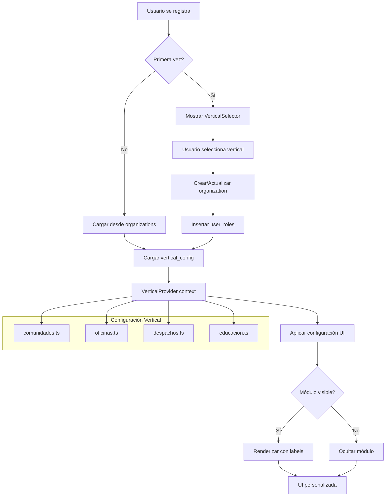
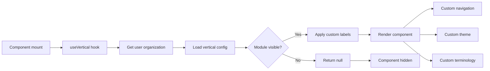

<!--
ARCHIVO: doc_verticales.md
PROPÓSITO: Plan completo implementación sistema de verticales multi-industria
ESTADO: development
DEPENDENCIAS: Supabase tables, tenant_config.py
OUTPUTS: Arquitectura modular por sector empresarial
ACTUALIZADO: 2025-10-01
-->

# PLAN IMPLEMENTACIÓN: SISTEMA DE VERTICALES MULTI-INDUSTRIA

## 1. OBJETIVO Y SCOPE

### 🎯 **Objetivo Principal:**
Transformar el SaaS actual en una plataforma multi-vertical que se adapte automáticamente según el tipo de organización del usuario, manteniendo un backend único pero personalizando completamente la experiencia UI.

### 📊 **Verticales Objetivo:**
- **COMUNIDADES** (actual) - Comunidades de vecinos, asociaciones
- **OFICINAS** - Empresas corporativas, startups, consultorías  
- **DESPACHOS** - Abogados, notarías, asesorías
- **EDUCACIÓN** - Colegios, institutos, universidades

---

## 2. ANÁLISIS ARQUITECTURA ACTUAL

### 🗄️ **Estructura de Tablas Supabase (VERIFICADA 2025-10-01):**

#### **A. `organizations` (Contenedor principal) - ESTRUCTURA ACTUAL:**
```sql
-- VERIFICADO con supabase gen types --project-id vhybocthkbupgedovovj
organizations: {
  id: string (PK)
  name: string (unique)
  owner_id: string → auth.users
  subscription_plan: string ('basic'|'premium'|'enterprise')
  max_communities: number (default: 5)
  max_users_per_community: number (default: 500)
  is_active: boolean
  contact_email: string | null
  contact_phone: string | null  
  description: string | null
  timezone: string | null (default: 'UTC')
  locale: string | null (default: 'es-ES')
  created_at: string
  updated_at: string
}

-- COLUMNAS A AÑADIR:
+ vertical_type: text (NUEVA COLUMNA)
+ vertical_config: jsonb (NUEVA COLUMNA)
```

#### **B. `user_roles` (Relación user-organización)**
```sql
- user_id: uuid → auth.users
- organization_id: uuid → organizations  
- community_id: uuid → communities (nullable)
- role: 'admin'|'manager'|'resident'
```

### 🔍 **ARQUITECTURA MULTI-TENANT VERIFICADA:**

#### **Sistema de 36 Tablas con RLS:**
```sql
-- TODAS las tablas tienen organization_id como discriminador
documents: organization_id → Aislamiento automático por RLS
incidents: organization_id → Solo ve incidencias de su organización
communities: organization_id → Solo ve comunidades de su organización
document_chunks: organization_id → Chunks aislados por tenant
document_metadata: organization_id → Metadatos aislados por tenant
extracted_*: organization_id → Datos extraídos aislados por tenant
user_roles: organization_id → Permisos user-organization-community
agents: organization_id → Agentes IA por organización
```

#### **Patrón Multi-Tenant CONFIRMADO:**
- ✅ **Tablas compartidas** con Row Level Security (RLS)
- ✅ **Aislamiento automático** mediante `organization_id` 
- ✅ **Función helper**: `get_user_organization_id()` filtra automáticamente
- ✅ **Políticas RLS** en todas las tablas principales
- ✅ **3 niveles** de aislamiento: Organization → Community → User

### 🎯 **DECISIÓN ARQUITECTÓNICA:**
**Aprovechar `organizations` como contenedor de configuración vertical** - Cada usuario pertenece a una organización que define su vertical.

---

## 3. ARQUITECTURA DE ARCHIVOS

### 📁 **Nueva Estructura Modular:**

```
src/
├── config/
│   └── verticals/
│       ├── index.ts                 # Export central + types
│       ├── comunidades.ts          # Config vertical comunidades
│       ├── oficinas.ts             # Config vertical oficinas  
│       ├── despachos.ts            # Config vertical despachos
│       ├── educacion.ts            # Config vertical educación
│       └── types.ts                # TypeScript interfaces
│
├── providers/
│   └── VerticalProvider.tsx        # Context provider para UI
│
├── hooks/
│   ├── useVertical.ts              # Hook acceso configuración
│   └── useUserOrganization.ts      # Hook datos organización user
│
├── components/
│   └── vertical/
│       ├── VerticalSelector.tsx    # Selector durante registro
│       ├── ModuleVisibility.tsx    # HOC mostrar/ocultar módulos
│       └── LabelRenderer.tsx       # Renderizado labels dinámicos
│
└── utils/
    └── vertical-utils.ts           # Utilidades configuración
```

### 📄 **Ejemplo Configuración Vertical:**

```typescript
// src/config/verticals/oficinas.ts
export const oficinasVertical: VerticalConfig = {
  id: 'oficinas',
  name: 'Oficinas Corporativas',
  description: 'Gestión empresarial y departamental',
  
  modules: {
    visible: ['documents', 'incidents', 'communities', 'chat'],
    hidden: ['foro']
  },
  
  labels: {
    incidents: 'Tickets',
    communities: 'Departamentos', 
    'incidents.new': 'Crear Ticket',
    'incidents.list': 'Lista de Tickets'
  },
  
  navigation: {
    mainMenu: [
      { key: 'documents', label: 'Documentos', icon: 'FileText' },
      { key: 'incidents', label: 'Tickets', icon: 'AlertCircle' },
      { key: 'communities', label: 'Departamentos', icon: 'Building2' },
      { key: 'chat', label: 'Chat IA', icon: 'MessageSquare' }
    ]
  },
  
  theme: {
    primary: '#2563eb',    // Azul corporativo
    accent: '#0ea5e9'
  }
}
```

---

## 4. FLUJO COMPLETO DEL SISTEMA

### 🔄 **Diagrama Mermaid - Flujo de Configuración Vertical:**



### 🔄 **Diagrama Mermaid - Flujo de Renderizado:**



---

## 5. PLAN DE IMPLEMENTACIÓN

### 🏗️ **FASE 1: Infraestructura Base (1 semana)**

#### **1.1 Migración Supabase (CRÍTICA)**
```sql
-- CONEXIÓN VERIFICADA: vhybocthkbupgedovovj.supabase.co
-- COMANDO: supabase gen types --project-id vhybocthkbupgedovovj

-- Añadir columnas a organizations (tabla verificada)
ALTER TABLE organizations 
ADD COLUMN vertical_type text DEFAULT 'comunidades',
ADD COLUMN vertical_config jsonb DEFAULT '{}';

-- Constraint para vertical_type
ALTER TABLE organizations 
ADD CONSTRAINT organizations_vertical_type_check 
CHECK (vertical_type IN ('comunidades', 'oficinas', 'despachos', 'educacion'));

-- Índice para búsquedas
CREATE INDEX idx_organizations_vertical_type 
ON organizations(vertical_type);

-- Actualizar tipos TypeScript después de migración
-- COMANDO POST-MIGRACIÓN: supabase gen types --project-id vhybocthkbupgedovovj --schema public > src/types/database.types.ts
```

#### **1.2 Crear configuraciones base**
- [x] `src/config/verticals/index.ts`
- [x] `src/config/verticals/comunidades.ts` (migrar configuración actual)
- [x] `src/config/verticals/oficinas.ts` (nueva)

#### **1.3 Context Provider**
- [x] `src/providers/VerticalProvider.tsx`
- [x] `src/hooks/useVertical.ts`

### 🏗️ **FASE 2: Selector de Vertical (1 semana)**

#### **2.1 Componente selector**
- [x] `src/components/vertical/VerticalSelector.tsx`
- [x] Integración en página de registro
- [x] Lógica creación automática organization

#### **2.2 Flujo de registro modificado**
```typescript
// Flujo actual: Usuario → auth.users
// Flujo nuevo: Usuario → auth.users → organizations → user_roles
```

### 🏗️ **FASE 3: Aplicación UI (1 semana)**

#### **3.1 HOCs y utilidades**
- [x] `src/components/vertical/ModuleVisibility.tsx`
- [x] `src/components/vertical/LabelRenderer.tsx`
- [x] `src/utils/vertical-utils.ts`

#### **3.2 Integración en componentes existentes**
- [x] Modificar sidebar principal
- [x] Aplicar labels dinámicos
- [x] Ocultar/mostrar módulos

### 🏗️ **FASE 4: Testing y Refinamiento (1 semana)**

#### **4.1 Testing funcional**
- [x] Registro usuario vertical "oficinas"
- [x] Verificar UI adaptada (Tickets vs Incidencias)
- [x] Verificar módulos ocultos (Foro)

#### **4.2 Migración usuarios existentes**
- [x] Script migración organizations para usuarios actuales
- [x] Asignación automática vertical "comunidades"

---

## 6. TESTING Y VALIDACIÓN

### 🧪 **Plan de Testing:**

#### **6.1 Testing Automatizado**
```javascript
// tests/vertical.test.ts
describe('Vertical System', () => {
  test('Usuario oficinas ve "Tickets" en lugar de "Incidencias"')
  test('Usuario oficinas NO ve módulo "Foro"') 
  test('Usuario comunidades mantiene funcionalidad actual')
})
```

#### **6.2 Testing Manual**
1. **Registro nuevo usuario** → Seleccionar "Oficinas" → Verificar UI
2. **Usuario existente** → Migrar a "Comunidades" → Verificar sin cambios
3. **Cambio de vertical** → Admin panel → Verificar actualización UI

### 🔍 **Criterios de Éxito:**
- ✅ Backend sin cambios (mismas APIs, mismas tablas de datos)
- ✅ UI completamente diferente por vertical
- ✅ Usuarios existentes sin impacto
- ✅ Fácil añadir nuevos verticales

---

## 7. MIGRACIÓN DE DATOS EXISTENTES

### 📊 **Plan Migración:**

#### **7.1 Usuarios actuales**
```sql
-- Crear organization para usuarios sin organization
INSERT INTO organizations (name, owner_id, vertical_type, vertical_config)
SELECT 
  CONCAT(email, ' - Organización'),
  id,
  'comunidades',
  '{}'::jsonb
FROM auth.users 
WHERE id NOT IN (SELECT owner_id FROM organizations);

-- Crear user_roles para asociar usuarios a organizations
INSERT INTO user_roles (user_id, organization_id, role)
SELECT 
  u.id,
  o.id,
  'admin'
FROM auth.users u
JOIN organizations o ON o.owner_id = u.id
WHERE NOT EXISTS (
  SELECT 1 FROM user_roles ur 
  WHERE ur.user_id = u.id AND ur.organization_id = o.id
);
```

#### **7.2 Verificación post-migración**
```sql
-- Verificar todos los usuarios tienen organization
SELECT COUNT(*) FROM auth.users u
LEFT JOIN user_roles ur ON ur.user_id = u.id
WHERE ur.organization_id IS NULL;
-- Resultado esperado: 0
```

---

## 8. ROADMAP FUTURO

### 🚀 **Verticales Adicionales:**

#### **8.1 Despachos Legales**
- Módulos: Expedientes, Comunicaciones, Casos, Chat IA
- Labels: Cliente → Expediente, Incidencia → Caso

#### **8.2 Educación**  
- Módulos: Documentos Académicos, Comunicaciones, Aulas, Foro, Chat IA
- Labels: Comunidad → Aula, Incidencia → Reporte

### 💰 **Monetización por Vertical**
- **Comunidades**: Plan básico €29/mes
- **Oficinas**: Plan business €79/mes  
- **Despachos**: Plan professional €149/mes
- **Educación**: Plan educativo €99/mes

---

## 9. CONCLUSIONES

### ✅ **Ventajas Arquitectónicas:**
1. **Backend único** → Mantenimiento simplificado
2. **UI específica** → Cada sector siente que es "su" herramienta
3. **Escalable** → Fácil añadir nuevos verticales
4. **Monetizable** → Diferentes precios por sector

### 🔧 **Complejidad Estimada (ACTUALIZADA):** 
**⭐⭐ (2/10)** - Simple, arquitectura multi-tenant ya operativa con 36 tablas

### 📅 **Timeline Total:** 
**2-3 semanas** para implementación completa con 2 verticales funcionales

### 🎯 **Contexto Técnico Completo:**
- ✅ **Supabase CLI**: v1.200.3 operativo
- ✅ **Proyecto**: vhybocthkbupgedovovj.supabase.co  
- ✅ **36 tablas** con RLS multi-tenant funcional
- ✅ **Backend robusto**: Sistema documentos, metadatos, chunks, embeddings
- ✅ **Arquitectura validada**: Solo necesita 2 columnas en `organizations`

### 🚀 **Primer Milestone:**
Implementar vertical "Oficinas" como proof of concept, manteniendo "Comunidades" como está.

---

## 10. ACCIONES INMEDIATAS (Ready to Execute)

### ✅ **FASE 1 - LISTO PARA EMPEZAR:**

#### **1.1 Migración Base de Datos**
- [x] **Verificada estructura** actual organizations
- [x] **Comando listo**: ALTER TABLE organizations ADD COLUMN...
- [x] **Conexión confirmada**: vhybocthkbupgedovovj

#### **1.2 Configuraciones de Código**
- [ ] Crear `src/config/verticals/` (estructura definida)
- [ ] Implementar configuración "comunidades" (actual)
- [ ] Implementar configuración "oficinas" (nueva)

#### **1.3 Context Provider**
- [ ] Crear `VerticalProvider` (specs definidas)
- [ ] Hook `useVertical` (integración RLS)
- [ ] Hook `useUserOrganization` (multi-tenant)

**Estado: READY TO START** 🚀