# L1.7 - Plan Maestro: Implementación Sistema de Gestión Documental + IA/RAG

## Resumen Ejecutivo

Este plan maestro establece la implementación sistemática de un sistema completo de gestión documental con capacidades de IA y RAG (Retrieval Augmented Generation) para la plataforma Community SaaS. La implementación se divide en 4 fases incrementales, cada una proporcionando valor inmediato mientras construye hacia el sistema completo.

## Arquitectura del Sistema

### Stack Tecnológico

- **Frontend**: Next.js 15.3.0 + React 19.1.0 + TypeScript 5.8.3
- **Backend**: Next.js API Routes + Server Actions
- **Base de Datos**: Supabase PostgreSQL 2.49.4 + pgvector
- **Storage**: Supabase Storage para archivos
- **IA/LLM**: Google Gemini Flash 1.5 (calidad/precio óptimo)
- **Vector Database**: pgvector (extensión PostgreSQL integrada)
- **UI Framework**: Tailwind CSS 4.1.3 + shadcn/ui + Radix UI
- **State Management**: React Query 4.36.1 + React Hook Form + Zod
- **Development**: ESLint + Prettier + Vitest + Playwright

### Principios Multi-tenant

- Aislamiento completo por `organization_id`
- RLS (Row Level Security) en todas las tablas
- Cuotas por organización (storage, tokens IA, documentos)
- Permisos granulares por comunidad y rol

## Agentes para el desarrollo del SaaS

### 🔧 **Agentes Claude Code (.claude/) - Para Desarrollo**

1. **dbmaster-supabase** ✅ - Migraciones y optimización BD
2. **deployment-master** ✅ - Despliegues automatizados
3. **ui-guardian** ✅ - Testing workflows UI/UX
4. **vercel-master** ✅ - Issues deployment Vercel
5. **architect-master** ✅ - Coordinación desarrollo

### 🤖 **Agentes SaaS (Tabla `agents`) - Para Procesamiento**

Los agentes del SaaS procesan documentos con prompts específicos y Gemini Flash 1.5:

```sql
-- Tabla de agentes del sistema SaaS
CREATE TABLE agents (
  id UUID PRIMARY KEY DEFAULT gen_random_uuid(),
  organization_id UUID REFERENCES organizations(id), -- Multi-tenant
  name TEXT NOT NULL,
  purpose TEXT NOT NULL,
  prompt_template TEXT NOT NULL,
  variables JSONB DEFAULT '{}',
  model_config JSONB DEFAULT '{
    "model": "gemini-1.5-flash",
    "temperature": 0.1,
    "max_tokens": 2048
  }',
  is_active BOOLEAN DEFAULT true,
  created_at TIMESTAMPTZ DEFAULT NOW()
);
```

#### **Agentes SaaS Necesarios:**

1. **document_classifier**

   - Clasifica PDFs en: acta, factura, comunicado, contrato, presupuesto
   - Prompt: "Analiza el texto y devuelve únicamente la categoría..."

2. **minutes_extractor**

   - Extrae: presidente entrante/saliente, administrador, resumen, decisiones
   - Output: JSON estructurado para tabla `extracted_minutes`

3. **invoice_extractor**

   - Extrae: proveedor, cliente, importe, fecha, categoría
   - Output: JSON para tabla `extracted_invoices`

4. **query_analyzer**

   - Analiza consultas de usuarios
   - Determina: búsqueda semántica vs estructurada, filtros necesarios

5. **rag_responder**
   - Genera respuestas conversacionales
   - Input: contexto recuperado + pregunta usuario
   - Output: respuesta natural y amigable

### Estrategia de Coordinación de Agentes

#### **Modelo de Orquestación Automática vs Manual**

**🎯 Recomendación: Orquestación Híbrida**

1. **Decisiones Arquitectónicas**: Manual (tú decides)
2. **Implementación de Fases**: Automática (architect-master coordina)
3. **Tasks específicas**: Automática (cada agente especializado)

```typescript
// Ejemplo de workflow automático
interface PhaseWorkflow {
  phase: number;
  coordinator: 'architect-master';
  agents: {
    dbmaster: 'schema_creation';
    document_processor: 'extraction_pipeline';
    embedding_master: 'vector_generation';
    ui_guardian: 'user_testing';
  };
  decision_points: 'manual_approval_required'[];
}
```

## FASE 1: Fundación y Almacenamiento de Documentos (2-3 semanas)

### Objetivos

✅ Esquema de base de datos completo
✅ Sistema de upload de archivos básico
✅ Gestión de metadatos
✅ Interfaz de administración de documentos

### 1.1 Esquema de Base de Datos

```sql
-- Tabla principal de documentos (multi-tenant)
CREATE TABLE documents (
  id UUID PRIMARY KEY DEFAULT gen_random_uuid(),
  organization_id UUID REFERENCES organizations(id) NOT NULL,
  community_id UUID REFERENCES communities(id),
  name TEXT NOT NULL,
  file_path TEXT NOT NULL,
  file_size BIGINT NOT NULL,
  mime_type TEXT NOT NULL,
  file_hash TEXT NOT NULL, -- Para detectar duplicados
  document_type TEXT CHECK (document_type IN ('acta', 'factura', 'comunicado', 'contrato', 'presupuesto')),
  processing_status TEXT DEFAULT 'pending' CHECK (processing_status IN ('pending', 'processing', 'completed', 'error')),
  uploaded_by UUID REFERENCES auth.users(id) NOT NULL,
  upload_date TIMESTAMPTZ DEFAULT NOW(),
  processed_at TIMESTAMPTZ,
  metadata_json JSONB DEFAULT '{}',
  created_at TIMESTAMPTZ DEFAULT NOW(),
  updated_at TIMESTAMPTZ DEFAULT NOW()
);

-- Tabla de chunks extraídos para RAG
CREATE TABLE document_chunks (
  id UUID PRIMARY KEY DEFAULT gen_random_uuid(),
  document_id UUID REFERENCES documents(id) ON DELETE CASCADE,
  organization_id UUID REFERENCES organizations(id) NOT NULL,
  chunk_index INTEGER NOT NULL,
  content TEXT NOT NULL,
  token_count INTEGER,
  metadata_json JSONB DEFAULT '{}',
  created_at TIMESTAMPTZ DEFAULT NOW()
);

-- Tabla de embeddings vectoriales
CREATE TABLE document_embeddings (
  id UUID PRIMARY KEY DEFAULT gen_random_uuid(),
  chunk_id UUID REFERENCES document_chunks(id) ON DELETE CASCADE,
  organization_id UUID REFERENCES organizations(id) NOT NULL,
  embedding VECTOR(768), -- Gemini embedding dimension
  created_at TIMESTAMPTZ DEFAULT NOW()
);

-- Configuración organizacional para IA
CREATE TABLE organization_ai_config (
  organization_id UUID REFERENCES organizations(id) PRIMARY KEY,
  gemini_api_key TEXT, -- Encrypted
  max_documents INTEGER DEFAULT 1000,
  max_storage_gb INTEGER DEFAULT 10,
  embedding_model TEXT DEFAULT 'text-embedding-004',
  processing_enabled BOOLEAN DEFAULT true,
  created_at TIMESTAMPTZ DEFAULT NOW(),
  updated_at TIMESTAMPTZ DEFAULT NOW()
);

-- Tablas de datos estructurados extraídos por IA
CREATE TABLE extracted_minutes (
  id UUID PRIMARY KEY DEFAULT gen_random_uuid(),
  document_id UUID REFERENCES documents(id) ON DELETE CASCADE,
  organization_id UUID REFERENCES organizations(id) NOT NULL,
  president_in TEXT,
  president_out TEXT,
  administrator TEXT,
  summary TEXT,
  decisions JSONB,
  meeting_date DATE,
  created_at TIMESTAMPTZ DEFAULT NOW()
);

CREATE TABLE extracted_invoices (
  id UUID PRIMARY KEY DEFAULT gen_random_uuid(),
  document_id UUID REFERENCES documents(id) ON DELETE CASCADE,
  organization_id UUID REFERENCES organizations(id) NOT NULL,
  provider_name TEXT,
  client_name TEXT,
  amount DECIMAL(12,2),
  invoice_date DATE,
  category TEXT,
  created_at TIMESTAMPTZ DEFAULT NOW()
);
```

### 1.2 RLS Policies (Multi-tenant Security)

```sql
-- Policies para documents
CREATE POLICY "organization_isolation_documents"
ON documents FOR ALL
USING (organization_id = get_user_organization_id());

-- Policies para chunks y embeddings
CREATE POLICY "organization_isolation_chunks"
ON document_chunks FOR ALL
USING (organization_id = get_user_organization_id());
```

### Entregables Fase 1

- [ ] **dbmaster-supabase**: Migración schema completo (documents, agents, extracted\_\*)
- [ ] **architect-master**: Página `/documents` funcional con upload
- [ ] **dbmaster-supabase**: RLS policies multi-tenant implementadas
- [ ] **architect-master**: Agentes SaaS base configurados en BD

### Responsabilidades (Fase 1)

**🔧 Agentes Claude Code:**

- **architect-master**: Coordina implementación, desarrolla UI básica
- **dbmaster-supabase**: Migraciones BD, RLS, optimizaciones
- **ui-guardian**: Testing workflows de upload/gestión documentos
- **deployment-master**: Deploy cada milestone a producción

**🤖 Agentes SaaS:**

- Los agentes de procesamiento se configuran en BD pero aún no se usan

## FASE 2: Pipeline de Procesamiento IA (3-4 semanas)

### Objetivos

✅ Extracción automática de texto
✅ Chunking inteligente
✅ Generación de embeddings con Gemini
✅ Sistema de colas para procesamiento

### 2.1 Sistema de Procesamiento con Agentes SaaS

```typescript
// Server Action que usa los agentes SaaS
async function processDocument(documentId: string) {
  // 1. Extraer texto del PDF (pdf-parse/mammoth)
  const documentText = await extractText(filePath);

  // 2. Usar agente 'document_classifier' para determinar tipo
  const documentType = await callSaasAgent('document_classifier', {
    document_text: documentText,
  });

  // 3. Usar agente específico según tipo (ej: 'minutes_extractor')
  const extractedData = await callSaasAgent(`${documentType}_extractor`, {
    document_text: documentText,
  });

  // 4. Guardar datos estructurados
  await saveExtractedData(documentType, extractedData);

  // 5. Chunking y embeddings
  const chunks = await chunkText(documentText);
  const embeddings = await generateEmbeddings(chunks);
  await saveEmbeddings(documentId, embeddings);
}
```

### 2.2 Configuración de Agentes SaaS

```sql
-- Insertar prompts específicos en tabla agents
INSERT INTO agents (name, purpose, prompt_template, variables) VALUES
('document_classifier',
 'Clasificar tipo de documento',
 'Clasifica este documento en una categoría: acta, factura, comunicado, contrato, presupuesto.

Texto: {document_text}

Responde solo con la categoría.',
 '{"input_key": "document_text", "output_type": "string"}');
```

### Entregables Fase 2

- [ ] **architect-master**: Server Actions usando agentes SaaS
- [ ] **dbmaster-supabase**: Agentes SaaS configurados con prompts
- [ ] **architect-master**: Pipeline extracción + clasificación funcionando
- [ ] **ui-guardian**: UI mostrando progreso y resultados procesamiento

## FASE 3: Búsqueda Vectorial y RAG (4-5 semanas)

### 3.1 Motor de Búsqueda Vectorial (embedding-master)

```sql
-- Función de búsqueda por similitud (dbmaster-supabase)
CREATE OR REPLACE FUNCTION search_documents(
  query_embedding VECTOR(768),
  org_id UUID,
  community_id UUID DEFAULT NULL,
  similarity_threshold FLOAT DEFAULT 0.7,
  max_results INT DEFAULT 20
)
RETURNS TABLE (
  document_id UUID,
  chunk_content TEXT,
  similarity_score FLOAT,
  document_name TEXT
) AS $$
BEGIN
  RETURN QUERY
  SELECT
    dc.document_id,
    dc.content,
    1 - (de.embedding <=> query_embedding) as similarity,
    d.name
  FROM document_embeddings de
  JOIN document_chunks dc ON de.chunk_id = dc.id
  JOIN documents d ON dc.document_id = d.id
  WHERE de.organization_id = org_id
    AND (community_id IS NULL OR d.community_id = search_documents.community_id)
    AND 1 - (de.embedding <=> query_embedding) > similarity_threshold
  ORDER BY similarity DESC
  LIMIT max_results;
END;
$$ LANGUAGE plpgsql;
```

### 3.2 Sistema RAG (rag-coordinator)

```typescript
// Agente rag-coordinator responsable
interface RAGPipeline {
  queryAnalysis: {
    agent: 'Gemini Flash 1.5';
    extractFilters: ['community', 'document_type', 'date_range'];
    enrichQuery: boolean;
  };

  contextRetrieval: {
    vectorSearch: 'embedding-master';
    structuredQuery: 'dbmaster-supabase';
    hybridRanking: 'rag-coordinator';
  };

  responseGeneration: {
    model: 'Gemini Flash 1.5';
    contextWindow: '1M tokens';
    streaming: true;
  };
}
```

### Entregables Fase 3

- [ ] **embedding-master**: Búsqueda vectorial operativa
- [ ] **rag-coordinator**: RAG endpoints funcionando
- [ ] **ui-guardian**: Interface de búsqueda implementada
- [ ] **architect-master**: Métricas de relevancia visibles

## FASE 4: Chat Interface y Funcionalidades Avanzadas (3-4 semanas)

### 4.1 Chat Interface (ui-guardian + rag-coordinator)

```typescript
interface ChatSystem {
  frontend: {
    agent: 'ui-guardian';
    features: ['streaming_responses', 'message_history', 'source_citations'];
  };

  backend: {
    agent: 'rag-coordinator';
    features: ['session_management', 'context_retention', 'cost_tracking'];
  };
}
```

### Entregables Fase 4

- [ ] **ui-guardian**: Chat interface completamente funcional
- [ ] **rag-coordinator**: Sistema de sesiones implementado
- [ ] **architect-master**: Funcionalidades de colaboración básicas
- [ ] **deployment-master**: Dashboard de analytics operativo

## Cronograma y Coordinación

### Metodología de Trabajo

#### **1. ¿Qué decides TÚ manualmente?**

- ✅ Aprobación de cada fase antes de continuar
- ✅ Cambios arquitectónicos mayores
- ✅ Priorización de features
- ✅ Configuración de API keys y credenciales

#### **2. ¿Qué decide architect-master automáticamente?**

- ✅ Asignación de tareas específicas a agentes
- ✅ Orden de implementación dentro de cada fase
- ✅ Coordinación entre agentes especializados
- ✅ Resolución de conflictos técnicos menores

#### **3. Workflow de Fase Típico**

```mermaid
sequenceDiagram
    You->>architect-master: Aprobar Fase N
    architect-master->>dbmaster: Crear schemas
    architect-master->>document-processor: Implementar extracción
    architect-master->>ui-guardian: Desarrollar interfaz
    architect-master->>deployment-master: Deploy a staging
    architect-master->>You: Fase N completada, aprobar siguiente?
```



## Cronograma General

| Fase   | Duración      | Agente Líder       | Milestone               |
| ------ | ------------- | ------------------ | ----------------------- |
| Fase 1 | Semanas 1-3   | dbmaster-supabase  | Upload y gestión básica |
| Fase 2 | Semanas 4-7   | document-processor | Pipeline IA completo    |
| Fase 3 | Semanas 8-12  | rag-coordinator    | RAG funcional           |
| Fase 4 | Semanas 13-16 | ui-guardian        | Sistema completo        |

**Total: 16 semanas (4 meses)**

## Próximos Pasos Inmediatos

### 1. **¿Qué hacer PRIMERO?**

**Mi recomendación como architect-master:**

```bash
# OPCIÓN A: Empezar por DB Foundation (Recomendado)
1. dbmaster-supabase → Crear schema Fase 1
2. ui-guardian → Página básica /documents
3. deployment-master → Deploy y validar

# OPCIÓN B: Validar producción actual primero
1. deployment-master → Verificar deploy actual
2. ui-guardian → Testing completo de funcionalidad existente
3. Luego proceder con Fase 1
```

### 2. **Configuración de Nuevos Agentes**

```json
// .claude/document-processor.json (Pendiente crear)
{
  "name": "document-processor",
  "description": "PDF processing and text extraction specialist",
  "tools": ["pdf-parse", "mammoth", "file-upload"],
  "model": "claude-3-5-sonnet-20241022"
}
```

### 3. **Decisión Clave: ¿Proceder con Fase 1 o Deploy primero?**

**Recomiendo:** Validar deploy actual → Luego Fase 1

**Razón:** Tener una base estable antes de añadir complejidad del RAG system.

---

## Respuesta a tus Preguntas Específicas

### **1. ¿Qué debería hacer primero?**

**R:** Validar deploy actual con deployment-master, luego iniciar Fase 1 con dbmaster-supabase.

### **2. ¿Debería tener un agente arquitecto?**

**R:** ✅ Ya tienes architect-master configurado. Debe coordinar pero tú tomas decisiones arquitectónicas mayores.

### **3. ¿Es mejor que decida yo o automático?**

**R:** **Híbrido** - Tú decides el QUÉ (estrategia, fases), architect-master decide el CÓMO (implementación, coordinación).

### **4. ¿Qué agentes faltan?**

**R:** Necesitas 3 agentes nuevos especializados:

- `document-processor` (extracción de texto)
- `embedding-master` (vectorización)
- `rag-coordinator` (chat inteligente)

---

🤖 **Generado por Claude Code - Architect Master Agent**  
📅 **Fecha**: 2025-01-11  
📋 **Versión**: 1.1 (Corregida con stack real + Gemini)  
🎯 **Estado**: Listo para aprobación de Fase 1
