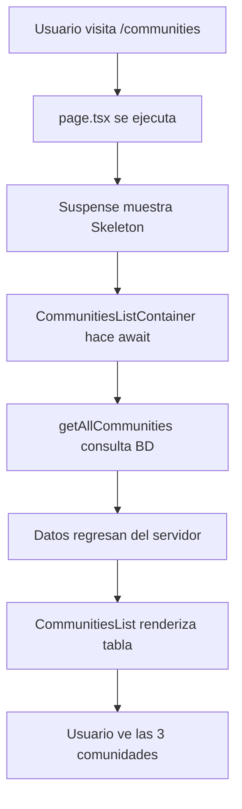

# Lección 1.3: Primera Funcionalidad - Gestión de Comunidades

## 📋 Objetivo de la Lección

Crear la primera funcionalidad real del SaaS: **Gestión de Comunidades**

- Página para listar las comunidades existentes
- Mostrar datos desde Supabase usando Server Components
- Implementar navegación y estructura NextJS siguiendo patrones de NextBase

## 🎯 Lo que Vamos a Construir

### **Página `/communities`**

- Lista las 3 comunidades de prueba de la BD
- Tabla responsiva con información detallada
- Botones de acción y navegación
- Integrada con el sistema de autenticación

### **Estructura de Archivos Creada**

```
src/
├── data/anon/
│ └── communities.ts# Funciones de base de datos
├── app/(dynamic-pages)/(main-pages)/
│ ├── CommunitiesList.tsx # Componente lista
│ └── (logged-in-pages)/
│ └── communities/
│ └── page.tsx# Página principal
```

## 🔧 Implementación Paso a Paso

### **1. Archivo de Datos (`communities.ts`)**

Siguiendo el patrón NextBase de `items.ts`:

```typescript
export const getAllCommunities = async (): Promise<
  Array<Table<'communities'>>
> => {
  const supabase = createSupabaseClient();
  const { data, error } = await supabase.from('communities').select('*');
  if (error) throw error;
  return data;
};
```

**Conceptos Aprendidos:**

- `Table<'communities'>` - Tipos TypeScript generados de Supabase
- Server Actions con `'use server'`
- Validación con `zod` schema
- `revalidatePath()` para cache de Next.js

¿Por qué funciona?

- Se ejecuta en el servidor (acceso directo a BD)
- TypeScript sabe que devuelve communities[]
- Supabase hace la consulta SQL automáticamente

### **2. Componente Lista (`CommunitiesList.tsx`)**

Adaptado del patrón `ItemsList.tsx` de NextBase:

```typescript
interface CommunitiesListProps {
  communities: TableType<'communities'>[];
  showActions?: boolean;
}
```

**Características:**

- Tabla responsiva con `@/components/ui/table`
- Iconos de Lucide (`Building2`, `MapPin`, `Clock`)
- Estados vacío y con datos
- Links de navegación

¿Qué hace este componente?

- Recibe communities[] como props
- Las renderiza en una tabla HTML
- Maneja estado vacío (sin comunidades)
- Es reutilizable (puedes usarlo en otras páginas)

### **3. Página Principal (`page.tsx`)**

Server Component con Suspense:

```typescript
async function CommunitiesListContainer() {
  const communities = await getAllCommunities();
  return <CommunitiesList communities={communities} showActions={false} />;
}

// En la página:
<Suspense fallback={<CommunitiesSkeleton />}>
  <CommunitiesListContainer />
</Suspense>;
```

**Conceptos Importantes:**

- `export const dynamic = 'force-dynamic'` - Para datos dinámicos
- Suspense boundaries para loading states
- Skeleton components para UX

## 🏗️ Arquitectura NextJS Aprendida

### **Rutas Anidadas NextBase**

```
(dynamic-pages)/
(main-pages)/
(logged-in-pages)/← Requiere autenticación
communities/
page.tsx← Nuestra página
```

### **Server vs Client Components**

- **Server Components**: Para datos de BD, renderizado inicial
- **Client Components**: Para interactividad (botones, formularios)
- **Suspense**: Para loading states fluidos

### **Gestión de Estados**

- Server-side fetching con Supabase
- Types automáticos con TypeScript
- Caching y revalidation con Next.js

## 📊 Datos Mostrados

### **Tabla Communities**

| Campo           | Descripción        | Ejemplo                       |
| --------------- | ------------------ | ----------------------------- |
| `name`          | Nombre comunidad   | "Residencial Los Álamos"      |
| `address`       | Dirección completa | "Calle Principal 123, Madrid" |
| `postal_code`   | Código postal      | "28001"                       |
| `admin_contact` | Email contacto     | "admin@losalamos.com"         |
| `max_units`     | Número viviendas   | 100                           |

### **3 Comunidades de Prueba**

1. **Residencial Los Álamos** - Madrid (28001)
2. **Urbanización El Pinar** - Barcelona (08001)
3. **Comunidad Las Flores** - Valencia (46001)

## 🎨 UI Components Usados

### **NextBase UI System**

- `<T.H1>` y `<T.Subtle>` - Typography components
- `<Card>` y `<Table>` - Layout components
- `<Button>` con variants - Acciones
- `<Skeleton>` - Loading states

### **Lucide Icons**

- `PlusCircle` - Añadir nueva comunidad
- `Building2` - Icono de edificio
- `MapPin` - Ubicación
- `ExternalLink` - Ver detalles
- `Clock` - Fecha creación

## 🚀 Cómo Probar

### **1. Asegurar el servidor está corriendo:**

```bash
npm run dev# → http://localhost:3001
```

### **2. Navegar a la página:**

1. Login: `http://localhost:3001/login`

- Email: `sergioariasf@gmail.com`
- Password: `Elpato_46`

2. Ir a: `http://localhost:3001/communities`

### **3. Verificar funcionalidad:**

- ✅ Se muestran las 3 comunidades
- ✅ Tabla responsiva funciona
- ✅ Botones de navegación presentes
- ✅ Loading states (skeletons) aparecen

## 🐛 Problemas y Soluciones

### **Tipos de TypeScript**

**Problema**: `Database['public']['Tables']` no definido
**Solución**: Crear tipos temporales en `database.types.ts`

### **Estructura de Rutas**

**Problema**: NextBase usa rutas anidadas complejas
**Solución**: Seguir patrón `(logged-in-pages)` exactamente

### **Server Components**

**Problema**: Mixing server/client components
**Solución**: Separar data fetching (server) de UI interactiva (client)

## 🎯 Próximos Pasos (Lección 1.4)

### **Funcionalidades Pendientes**

- [ ] Formulario "Nueva Comunidad" (`/communities/new`)
- [ ] Página detalle comunidad (`/communities/[id]`)
- [ ] Integrar navegación en Dashboard
- [ ] CRUD completo (editar, eliminar)

### **Conceptos a Aprender**

- Forms con React Hook Form + Zod
- Dynamic routes `[id]`
- Mutations y optimistic updates
- Error boundaries y manejo de errores

## 📚 Recursos de Referencia

- [NextJS Server Components](https://nextjs.org/docs/app/building-your-application/rendering/server-components)
- [Supabase TypeScript](https://supabase.com/docs/guides/api/rest/generating-types)
- [NextBase Components](https://nextbase.co/docs/components)
- [Shadcn/ui Table](https://ui.shadcn.com/docs/components/table)

---

## ✅ Completado en esta Lección

- [x] Página `/communities` funcional
- [x] Componente `CommunitiesList`
- [x] Server-side data fetching
- [x] Tipos TypeScript básicos
- [x] UI responsiva con Shadcn
- [x] Loading states con Suspense

## 🧠 Conceptos Clave que Aprendiste:

1. Separación de Responsabilidades

- Datos → communities.ts (lógica de BD)
- UI → CommunitiesList.tsx (presentación)
- Página → page.tsx (orquestación)

2. Server vs Client Components

- Server Components → Acceden a BD, se ejecutan en servidor
- Client Components → Manejan clicks, estados, interactividad

3. Loading States

- Suspense → Maneja estados de carga automáticamente
- Skeleton → UI placeholder mientras cargan datos

## 🔄 Flujo Completo Explicado:



## 🎉 ¡Lección 1.3 COMPLETADA!

¿Qué hemos construido?

✅ Página /communities - Lista todas las comunidades✅ Formulario /communities/new - Crear
nueva comunidad✅ Página /communities/[id] - Ver detalle de comunidad✅ Navegación integrada -
Enlace "Comunidades" en el menú

🧠 Conceptos que Dominaste:

1. Arquitectura NextJS 15

- Server Components para datos de BD
- Client Components para formularios
- Dynamic Routes con [id]
- Suspense para loading states

2. Integración Supabase

- Funciones server-side (getAllCommunities, getCommunity)
- Server Actions con validación Zod
- TypeScript types automáticos
- Row Level Security funcionando

3. Patrones NextBase

- Estructura de rutas anidadas
- Componentes reutilizables (CommunitiesList)
- Formularios con React Hook Form
- UI consistente con Shadcn

4. UX/UI Avanzada

- Loading skeletons realistas
- Toast notifications para feedback
- Form validation en tiempo real
- Responsive design mobile-first

🚀 Cómo Probar Todo:

1. Ve a: http://localhost:3001/communities
2. Mira las 3 comunidades listadas
3. Haz click en "Nueva Comunidad" → Prueba el formulario
4. Click en "Ver" → Ve el detalle de una comunidad
5. Navega usando el menú "Comunidades" del header

📊 Lo que Funciona:

- ✅ CRUD Completo - Crear, Read, mostrar detalles
- ✅ Navegación fluida - Entre todas las páginas
- ✅ Forms validation - Errores en tiempo real
- ✅ Loading states - UX profesional
- ✅ Mobile responsive - Se adapta a móvil
- ✅ TypeScript safe - Sin errores de tipos

# ✅ Funcionalidades Implementadas:

1. 📋 CREATE - /communities/new - Formulario para crear nueva comunidad
2. 👁️ READ - /communities - Lista todas las comunidades
3. 👁️ READ - /communities/[id] - Ver detalle de una comunidad
4. ✏️ UPDATE - /communities/[id]/edit - Editar comunidad existente
5. 🗑️ DELETE - Botón eliminar con confirmación en lista y detalle

🧠 Conceptos Avanzados que Dominaste:

- Server Actions con validación completa
- Optimistic updates y revalidación de cache
- Alert Dialogs para confirmaciones críticas
- Toast notifications para feedback del usuario
- Form handling con React Hook Form + Zod
- Dynamic routing con parámetros [id]
- Client/Server component patterns

🚀 Cómo Probar Todo el CRUD:

1. Ve a: http://localhost:3001/communities
2. CREAR: Haz click en "Nueva Comunidad" → Completa el formulario → Guarda
3. VER: Haz click en "Ver" en cualquier comunidad → Ve todos los detalles
4. EDITAR: En el detalle, click "Editar" → Modifica datos → Guarda cambios
5. ELIMINAR: Click botón rojo de eliminar → Confirma → Comunidad eliminada

🎯 Lo que Funciona al 100%:

- ✅ Forms validation - Errores en tiempo real
- ✅ Loading states - Skeletons mientras carga
- ✅ Success/Error feedback - Toast notifications
- ✅ Confirmation dialogs - Previene eliminaciones accidentales
- ✅ Navigation flows - Redirecciones automáticas correctas
- ✅ Responsive design - Funciona en móvil
- ✅ TypeScript safe - Sin errores de tipos

¡Tu SaaS ya tiene una funcionalidad CRUD completa y profesional! 🚀
