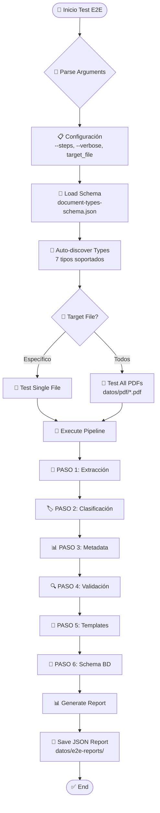
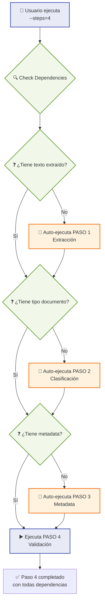
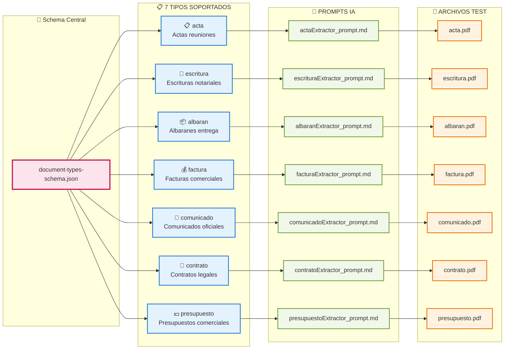
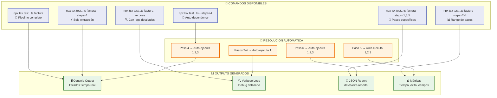

<!--
ARCHIVO: test-e2e-flow-diagram.md
PROPÓSITO: Diagramas Mermaid del flujo del test E2E modernizado
ESTADO: production
DEPENDENCIAS: test-complete-e2e-validation_1.ts
OUTPUTS: Diagramas de flujo, arquitectura visual
ACTUALIZADO: 2025-09-24
-->

# 📊 Diagramas de Flujo - Test E2E Modernizado

## 🚀 Flujo Principal del Test E2E



## 🔄 Pipeline de 6 Pasos Detallado

```mermaid
graph TD
    %% PASO 1: EXTRACCIÓN
    Step1[📄 PASO 1: EXTRACCIÓN] --> PDF[📁 factura.pdf<br/>377KB buffer]
    PDF --> TextFactory[🏭 TextExtractionFactory.ts<br/>CÓDIGO PRODUCCIÓN]
    
    TextFactory --> Strategy1{🔧 PDF-parse}
    Strategy1 -->|Falla| OCR[👁️ Google Vision OCR<br/>vision-api.json]
    Strategy1 -->|Éxito| ExtractOK[✅ 1113 chars extraídos]
    OCR --> ExtractOK
    
    %% PASO 2: CLASIFICACIÓN  
    ExtractOK --> Step2[🏷️ PASO 2: CLASIFICACIÓN]
    Step2 --> Classifier[🏭 DocumentClassifier.ts<br/>CÓDIGO PRODUCCIÓN]
    Classifier --> Pattern{🎯 Filename Pattern?}
    Pattern -->|Match| ClassifyOK[✅ factura - 95%]
    Pattern -->|No Match| AIClassify[🤖 AI Classification]
    AIClassify --> ClassifyOK
    
    %% PASO 3: METADATA
    ClassifyOK --> Step3[📊 PASO 3: METADATA]  
    Step3 --> SchemaConfig[🏭 schemaBasedConfig.ts<br/>CÓDIGO PRODUCCIÓN]
    SchemaConfig --> AgentPrompt[📄 facturaExtractor_prompt.md]
    AgentPrompt --> GeminiDirect[🧪 callGeminiDirect<br/>TEST-ONLY BYPASS]
    GeminiDirect --> MetadataOK[✅ 27 campos extraídos<br/>6080ms]
    
    %% PASO 4: VALIDACIÓN
    MetadataOK --> Step4[🔍 PASO 4: VALIDACIÓN]
    Step4 --> ValidateFields[🧪 getRequiredFieldsForType<br/>TEST-ONLY]
    ValidateFields --> ValidateTypes[🧪 isValidDate, Numbers<br/>TEST-ONLY]  
    ValidateTypes --> ValidationOK[✅ ÉXITO - 0 errores]
    
    %% PASO 5: TEMPLATES
    ValidationOK --> Step5[🎨 PASO 5: TEMPLATES]
    Step5 --> UISchema[🏭 document-types-schema.json<br/>ui_template.sections]
    UISchema --> CompatCheck[🧪 Template Compatibility<br/>TEST-ONLY]
    CompatCheck --> TemplateOK[✅ 100% compatibilidad]
    
    %% PASO 6: SCHEMA BD
    TemplateOK --> Step6[🔧 PASO 6: SCHEMA BD]
    Step6 --> DBSchema[🏭 document-types-schema.json<br/>database_schema]
    DBSchema --> SchemaCheck[🧪 BD Schema Validation<br/>TEST-ONLY]
    SchemaCheck --> SchemaOK[✅ VÁLIDO - 0 errores]
    
    %% Styling
    classDef productionCode fill:#e1f5fe,stroke:#0277bd,stroke-width:3px
    classDef testCode fill:#f3e5f5,stroke:#7b1fa2,stroke-width:3px
    classDef dataFile fill:#e8f5e8,stroke:#2e7d32,stroke-width:3px
    classDef success fill:#c8e6c9,stroke:#2e7d32,stroke-width:2px
    
    class TextFactory,Classifier,SchemaConfig,UISchema,DBSchema productionCode
    class GeminiDirect,ValidateFields,ValidateTypes,CompatCheck,SchemaCheck testCode  
    class PDF,AgentPrompt dataFile
    class ExtractOK,ClassifyOK,MetadataOK,ValidationOK,TemplateOK,SchemaOK success
```

## 🔄 Auto-Dependency Resolution



## 📊 Arquitectura: Código de Producción vs Test

```mermaid
graph TB
    subgraph "🏭 CÓDIGO DE PRODUCCIÓN"
        TextExt[TextExtractionFactory.ts<br/>📄 Extracción multi-estrategia]
        DocClass[DocumentClassifier.ts<br/>🏷️ Clasificación inteligente] 
        SchemaConf[schemaBasedConfig.ts<br/>📋 Configuración agentes]
        ResponseParser[ResponseParser.ts<br/>🔧 Parseo respuestas IA]
    end
    
    subgraph "🧪 CÓDIGO ESPECÍFICO TEST"
        CallGemini[callGeminiDirect()<br/>🤖 Acceso directo Gemini]
        GetSchema[getDocumentSchema()<br/>📁 Lectura directa schema]
        ValidateFields[getRequiredFieldsForType()<br/>🔍 Validación por tipo]
        ValidateDate[isValidDate()<br/>📅 Validación fechas]
    end
    
    subgraph "📁 ARCHIVOS DE DATOS"
        Schema[document-types-schema.json<br/>📋 Schema principal]
        Prompts[prompts/*.md<br/>📝 Templates IA]
        PDFs[datos/pdf/*.pdf<br/>📄 Archivos test]
        Reports[datos/e2e-reports/*.json<br/>📊 Resultados]
    end
    
    subgraph "🔧 VARIABLES ENTORNO"
        GeminiKey[GEMINI_API_KEY<br/>🤖 Clave API IA]
        VisionCreds[GOOGLE_APPLICATION_CREDENTIALS<br/>👁️ Credenciales OCR]
    end
    
    %% Conexiones principales
    TextExt --> PDFs
    TextExt --> VisionCreds
    DocClass --> TextExt
    SchemaConf --> Schema
    CallGemini --> GeminiKey
    CallGemini --> Prompts
    GetSchema --> Schema
    ValidateFields --> Schema
    
    %% Test utiliza producción
    CallGemini -.->|"🔄 Reemplaza"| ResponseParser
    GetSchema -.->|"🔄 Reemplaza"| SchemaConf
    
    %% Outputs
    ValidateDate --> Reports
    ValidateFields --> Reports
    
    %% Styling  
    classDef productionCode fill:#e1f5fe,stroke:#0277bd,stroke-width:3px
    classDef testCode fill:#f3e5f5,stroke:#7b1fa2,stroke-width:3px
    classDef dataFile fill:#e8f5e8,stroke:#2e7d32,stroke-width:3px
    classDef envVar fill:#fff8e1,stroke:#f57c00,stroke-width:2px
    
    class TextExt,DocClass,SchemaConf,ResponseParser productionCode
    class CallGemini,GetSchema,ValidateFields,ValidateDate testCode
    class Schema,Prompts,PDFs,Reports dataFile  
    class GeminiKey,VisionCreds envVar
```

## 🎯 Tipos de Documentos y Archivos Utilizados



## ⚡ Comandos y Flujos de Ejecución



---

## 📋 Resumen Visual de Archivos Clave

| Archivo | Tipo | Propósito |
|---------|------|-----------|
| `test-complete-e2e-validation_1.ts` | 🧪 Test | **Main test file** - Orquesta todo el pipeline |
| `TextExtractionFactory.ts` | 🏭 Prod | Extracción multi-estrategia de texto |
| `DocumentClassifier.ts` | 🏭 Prod | Clasificación inteligente de documentos |
| `schemaBasedConfig.ts` | 🏭 Prod | Configuración y schema management |
| `document-types-schema.json` | 📁 Data | **Schema central** - Define todos los tipos |
| `prompts/*.md` | 📝 Data | Templates para prompts de IA |
| `datos/pdf/*.pdf` | 📄 Data | Archivos PDF para testing |
| `extract-pdf-text.js` | 🔧 Tool | Script externo para PDF-parse |

---

### 🎯 **Flujo Completo en Una Línea:**
```
PDF → TextExtraction → Classification → AI Metadata → Validation → Template Check → DB Schema ✅
```